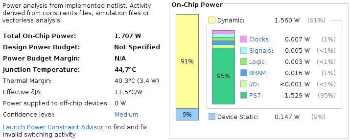
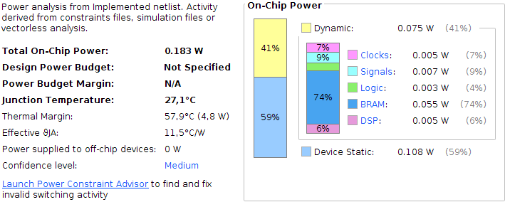
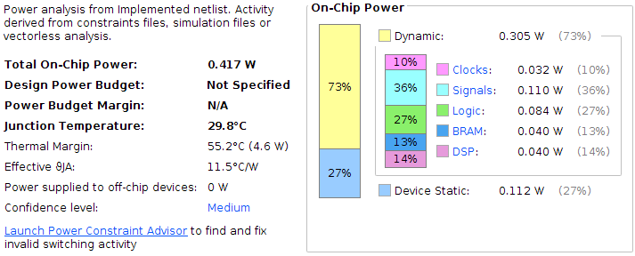

# Embedded AI on FPGA using High Level Synthesis #
> GSE5 Embedded Systems Project 2020-2021

The goal of the project is the full development of a Convolutional Neural Network (CNN) accelerated on a CPU / FPGA system using High Level Synthesis (HLS).
- Board: Zynq, ZedBoard
- SW: Vivado (for power/energy consumption analysis), Vivado HLS (for hls), SDSoC (for creating image + executables with and without acceleration)

Read further for test resultsfile structure, file contents and execution instruction.

> For execution on Zedboard, please follow the instructions below after connecting the device to a PC via UART

```sh
# open serial console
sudo minicom -D /dev/ttyACM0 -b 115200

# boot the device
boot

# mount file system
mount /dev/mmcblk0p1 /media 

# enter fs in SD card
cd /media

# run the appropriate .elf file
./executable.elf
```

## Tasks performed ##
- [x] Phase1 - Implement LeNet CNN (C)
- [x] Phase2 - Create fixed point implementation
- [x] Phase3 - Removal of hdf5 dependencies
- [x] Phase5 - Add pragmas, decrease latency
- [x] Phase6 - Test solution, validate measurements

## Final measurements ##

**Error: 201 / 10000**
**Success rate: 97.98998%**

### Execution time ###

Version      | Global time  | Local min (clk) | Local max (clk)
| :--- | ---: | ---: | ---:
SW           | 389s         | 7 413 302       | 16 111 340
HW           | 908s         | 43 946 334      | 48 133 712
HW + pragma  | 310s         | 1 854 234       | 5 928 854

### Power consumption ###

Version      | Global time  | On-chip power   | Energy
| :--- | ---: | ---: | ---:
SW           | 389s         | 1.707           | 664.02
HW           | 908s         | 0.183           | 166.16
HW + pragma  | 310s         | 0417            | 129.27

Version      | Global time  | Dynamic power   | Energy
| :--- | ---: | ---: | ---:
SW           | 389s         | 1.56            | 606.84
HW           | 908s         | 0.075           | 68.1
HW + pragma  | 310s         | 0.305           | 94.55






## Project files and directories ##
**FIXED\_POINT\_NO\_HDF5\_PRAGMA\_SDSOC**
> This folder contains the final files compiled by SDSoC (no continous printout, xilinx measurements added)
* **mnist** _containing image files_
* **weights\_exported** _txt files containing exported weights and biases from lenet_weights.hdf5_
  * **conv.c** _conv1 and conv2 functions_
  * **pool.c** _pool1 and pool2 functions_
  * **fc.c** _fc1 and fc2 functions_
  * **lenet_cnn_float.c** _main lenet_cnn function_
  * **lenet_cnn_float.h**
  * **utils.c** _util functions used mainly in lenet_cnn_float.c
  * **weights.h** _merged weights and biases for global usage - extracted from lenet_weights.hdf5_
  * **Makefile**
  
**FIXED\_POINT\_NO\_HDF5\_PRAGMA**
> same filestructure as directory FIXED\_POINT\_NO\_HDF5\_PRAGMA\_SDSOC, but without xilinx measurements and continous softmax printing. For compilation, the code within also had to changed a bit.
  
**FLOAT**
> first implementation for LeNet-5 CNN
* **mnist** _containing image files_
  * **conv.c** _conv1 and conv2 functions_
  * **pool.c** _pool1 and pool2 functions_
  * **fc.c** _fc1 and fc2 functions_
  * **lenet_cnn_float.c** _main lenet\_cnn function_
  * **lenet_cnn_float.h**
  * **lenet_weights.hdf5** _weights and biases in hdf5 format_
  * **utils.c _util** functions used mainly in lenet_cnn_float.c
  * **Makefile** _for compilation_

**synthesis_results**
  * **synth\_without\_pragma.html** _exported synthesis results from vivado hls without pragma usage_
  * **synth\_with\_pragma.html** _exported synthesis results from vivado hls with pragmas_

**lenet\_keras\_20\_40.py** _python function to train and test the model, obtain weights and biases_

**videos** _contains 2 recordings about the accelerated run (306s)_
  * **start_20201211_165019** 
  * **end_20201211_165544** 
  
**executables\_for\_Zedboard** _contains 3 versions with image, bottloader, executable files_

**images** _screenshots about execution times, images related to power consumption_

**Final\_report\_team11.pdf** _final report on the project_

